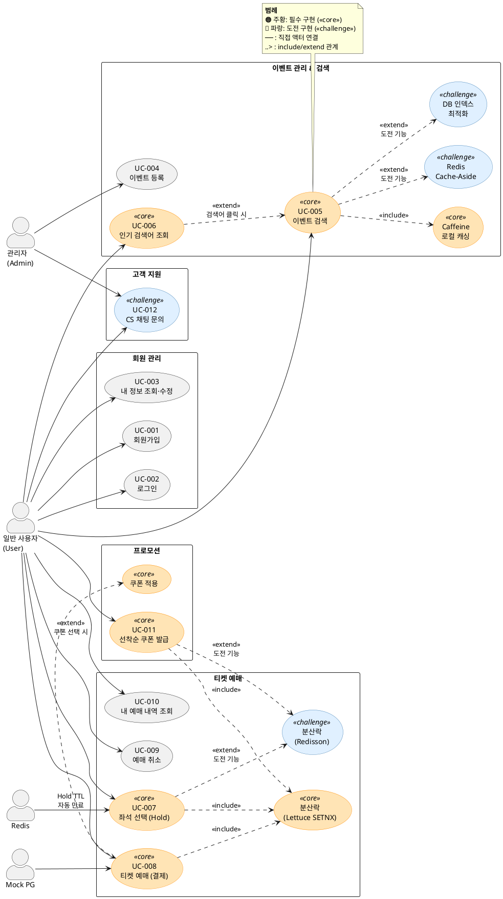

# 📘 유스케이스 명세서

> **문서 버전:** v3.0
> **최종 수정일:** 2026-04-10
> **변경 사유:**
> - UC-007: Hold 수 Race Condition 비고 추가 (Lua Script 원자적 처리 언급)
> - UC-008: 피드백 기준 13단계 플로우로 주요 흐름 재정렬, ORDER_ITEM 제거 반영
> - UC-009: 예매 취소 시 ACTIVE_BOOKING DELETE 반영
> - UC-011: 중복 발급 체크를 주요 흐름 1-1로 이동, 대체 흐름 위치 정정
> - UC-005: v1/v2 구현 상세 분기 제거, 사용자 관점으로 단순화
> - UC-012: 관리자 채팅방 목록 조회 및 진입 흐름 추가
> - UC-013: 수동 예매 확정 (Admin) 신규 추가
> **연결 문서:** 1. 프로젝트 개요서, 2. 사용자 시나리오 (페르소나)

---

## 액터 정의

| 액터 | 설명 | 대표 페르소나 |
|------|------|---------------|
| 일반 사용자 (User) | 회원가입·로그인 후 티켓 검색, 예매, 쿠폰 사용, CS 문의를 수행하는 사용자 | 박서준, 김하늘, 이도현 |
| 관리자 (Admin) | 이벤트·쿠폰 등록, CS 채팅 응대, 예매 상태 관리를 수행하는 운영자 | — |
| Mock PG | 결제 요청을 받아 웹훅으로 결과를 전송하는 외부 시스템 | — |
| Redis | TTL 기반 Hold 만료, 분산락 관리를 수행하는 인프라 액터 | — |

---

## 유스케이스 목록

| ID | 유스케이스 | 주요 액터 | 핵심 연결 기능 | 페르소나 |
|----|-----------|-----------|----------------|----------|
| UC-001 | 회원가입 | User | JWT 인증 | 공통 |
| UC-002 | 로그인 | User | JWT 인증 | 공통 |
| UC-003 | 내 정보 조회·수정 | User | JWT 인증 | 공통 |
| UC-004 | 이벤트 등록 | Admin | 이벤트 관리 | 최운영 |
| UC-005 | 이벤트 검색 | User | Caffeine/Redis 캐싱, DB 인덱스 | 김하늘 |
| UC-006 | 인기 검색어 조회 | User | Redis ZSet | 김하늘 |
| UC-007 | 좌석 선택 (Hold) | User | 분산락, 좌석 Hold TTL | 박서준 |
| UC-008 | 티켓 예매 (결제) | User, Mock PG | 웹훅, Hold 검증, 쿠폰 락 | 박서준, 이도현 |
| UC-009 | 예매 취소 | User | 좌석 상태 복원, ACTIVE_BOOKING 삭제 | 공통 |
| UC-010 | 내 예매 내역 조회 | User | — | 공통 |
| UC-011 | 선착순 쿠폰 발급 | User | Redis DECR + Lua (쿠폰) | 이도현 |
| UC-012 | CS 채팅 문의 | User, Admin | WebSocket STOMP | 이도현, 최운영 |
| UC-013 | 수동 예매 확정 | Admin | 비관적 락, ACTIVE_BOOKING | 최운영 |

---

## UC-001: 회원가입

- **액터**: 일반 사용자 (User)
- **사전조건**: 사용자가 TicketFlow에 가입되어 있지 않은 상태
- **주요 흐름**:
  1. 사용자가 회원가입 페이지에 접속한다.
  2. 이메일, 비밀번호, 닉네임을 입력한다.
  3. 시스템이 이메일 중복 여부를 검증한다.
  4. 시스템이 비밀번호를 BCrypt로 암호화하여 저장한다.
  5. 시스템이 회원가입 완료 응답을 반환한다.
- **대체 흐름**:
  - 3a. 이메일이 이미 존재하는 경우 → "이미 가입된 이메일입니다." 에러 반환 (409 Conflict)
- **예외 흐름**:
  - 2a. 이메일 형식이 올바르지 않은 경우 → 유효성 검증 실패 (400 Bad Request)
  - 2b. 비밀번호가 정책(8자 이상, 영문+숫자)에 부합하지 않는 경우 → 유효성 검증 실패 (400 Bad Request)
- **사후조건**: 사용자 정보가 DB에 저장되고, 로그인 가능한 상태가 된다.
- **관련 필수/도전 기능**: 필수 — 회원 관리

---

## UC-002: 로그인

- **액터**: 일반 사용자 (User)
- **사전조건**: 사용자가 회원가입을 완료한 상태
- **주요 흐름**:
  1. 사용자가 이메일과 비밀번호를 입력한다.
  2. 시스템이 이메일로 사용자를 조회한다.
  3. 시스템이 입력된 비밀번호와 저장된 BCrypt 해시를 비교한다.
  4. 인증 성공 시 JWT Access Token을 발급하여 응답한다.
- **대체 흐름**:
  - 3a. 비밀번호가 일치하지 않는 경우 → "이메일 또는 비밀번호가 올바르지 않습니다." (401 Unauthorized)
- **예외 흐름**:
  - 2a. 해당 이메일로 가입된 사용자가 없는 경우 → "이메일 또는 비밀번호가 올바르지 않습니다." (401 Unauthorized, 보안상 동일 메시지)
- **사후조건**: 클라이언트가 JWT Access Token을 보유하고, 인증이 필요한 API를 호출할 수 있다.
- **관련 필수/도전 기능**: 필수 — 회원 관리, JWT 인증

---

## UC-003: 내 정보 조회·수정

- **액터**: 일반 사용자 (User)
- **사전조건**: 사용자가 로그인한 상태 (유효한 JWT 보유)
- **주요 흐름**:
  1. 사용자가 마이페이지에 접속한다.
  2. 시스템이 JWT에서 userId를 추출하여 사용자 정보를 조회한다.
  3. 이메일, 닉네임, 가입일 등 정보를 표시한다.
  4. 사용자가 닉네임 또는 비밀번호 수정을 요청한다.
  5. 시스템이 변경 사항을 저장하고 성공 응답을 반환한다.
- **대체 흐름**:
  - 4a. 닉네임이 이미 사용 중인 경우 → "이미 사용 중인 닉네임입니다." (409 Conflict)
- **예외 흐름**:
  - 1a. JWT가 만료된 경우 → 401 Unauthorized 반환, 재로그인 유도
- **사후조건**: 수정된 사용자 정보가 DB에 반영된다.
- **관련 필수/도전 기능**: 필수 — 회원 관리

---

## UC-004: 이벤트 등록

- **액터**: 관리자 (Admin)
- **사전조건**: 관리자가 로그인한 상태 (ADMIN 권한 JWT 보유)
- **주요 흐름**:
  1. 관리자가 이벤트 등록 페이지에 접속한다.
  2. 이벤트 정보를 입력한다: 이벤트명, 카테고리(콘서트/뮤지컬/연극/스포츠), 장소, 일시, 회차 번호, 설명, 썸네일 URL.
  3. 구역(Section) 정보를 설정한다: 구역명, 가격, 좌석 수.
  4. 시스템이 이벤트와 구역·좌석 데이터를 생성한다.
  5. 각 구역의 좌석이 일괄 생성된다. (SEAT 테이블에 row_name + col_num 기준)
  6. 시스템이 등록 완료 응답을 반환한다.
- **대체 흐름**:
  - 2a. 이벤트 일시가 과거인 경우 → "이벤트 일시는 현재 이후여야 합니다." (400 Bad Request)
- **예외 흐름**:
  - 1a. ADMIN 권한이 없는 사용자가 접근 → 403 Forbidden
- **사후조건**: 이벤트·구역·좌석 데이터가 DB에 저장되고, 사용자 검색에 노출 가능한 상태가 된다.
- **관련 필수/도전 기능**: 필수 — 이벤트 관리, 구역/좌석 관리

---

## UC-005: 이벤트 검색 ⭐

> **페르소나 연결**: 김하늘 — "뮤지컬, 서울, 이번 달, 5만원 이하" 다중 조건 탐색

- **액터**: 일반 사용자 (User)
- **사전조건**: 등록된 이벤트가 1개 이상 존재
- **주요 흐름**:
  1. 사용자가 검색창에 키워드를 입력하거나 필터(카테고리, 날짜, 가격대)를 설정한다.
  2. 시스템이 검색어를 Redis ZSet에 ZINCRBY로 점수를 +1 한다. (인기 검색어 집계)
  3. 시스템이 검색 조건에 맞는 이벤트 목록을 조회하고 페이징된 결과를 반환한다.
     - 내부적으로 캐시 계층(Caffeine 또는 Redis Cache-Aside)을 거치며, 캐시 전략은 구현 단계에서 결정된다.
  4. 사용자에게 이벤트 목록 (이벤트명, 카테고리, 장소, 일시, 최저가)을 표시한다.
- **대체 흐름**:
  - 1a. 검색어 없이 필터만 설정한 경우 → 필터 조건만으로 조회
  - 4a. 검색 결과가 0건인 경우 → "검색 결과가 없습니다." 안내
- **예외 흐름**:
  - 3a. DB 쿼리 타임아웃 발생 → 500 Internal Server Error, 로그 기록
- **사후조건**: 검색 결과가 표시되고, 해당 검색어의 인기 검색어 점수가 +1 반영된다.
- **관련 필수/도전 기능**:
  - 필수 — 검색 v1 (캐시 미적용), 검색 v2 (Caffeine 로컬 캐시), 인기 검색어
  - 도전 — Redis Cache-Aside 패턴 전환, EXPLAIN 기반 DB 인덱스 최적화

---

## UC-006: 인기 검색어 조회

> **페르소나 연결**: 김하늘 — "요즘 뭐가 핫하지?" 트렌드 파악

- **액터**: 일반 사용자 (User)
- **사전조건**: 검색이 1회 이상 수행되어 Redis ZSet에 데이터가 존재
- **주요 흐름**:
  1. 사용자가 메인 화면에 접속하거나 검색 페이지를 연다.
  2. 시스템이 Redis ZSet에서 ZREVRANGE로 상위 10개 검색어와 점수를 조회한다.
  3. 인기 검색어 Top 10 목록을 순위와 함께 표시한다.
  4. 사용자가 인기 검색어를 클릭하면 해당 키워드로 UC-005(이벤트 검색)가 실행된다.
- **대체 흐름**:
  - 2a. ZSet이 비어있는 경우 → "아직 인기 검색어가 없습니다." 또는 기본 추천 키워드 표시
- **예외 흐름**:
  - 2b. Redis 연결 실패 → 인기 검색어 영역을 숨기고, 검색 기능은 정상 동작 (Graceful Degradation)
- **사후조건**: 사용자가 현재 인기 검색어 트렌드를 확인한다.
- **관련 필수/도전 기능**: 필수 — 인기 검색어 (Redis ZSet)

---

## UC-007: 좌석 선택 (Hold) ⭐

> **페르소나 연결**: 박서준 — 콘서트 오픈 직후 1,000명과 동시에 같은 좌석 클릭

- **액터**: 일반 사용자 (User)
- **사전조건**: 사용자가 로그인 상태이고, 해당 이벤트의 좌석 배치 화면에 접속한 상태
- **주요 흐름**:
  1. 사용자가 원하는 좌석을 클릭하여 선택 요청을 보낸다.
  2. 시스템이 해당 사용자의 현재 Hold 수를 확인한다. (`user-hold-count:{userId}` 카운터 조회 — M-02 대응, TTL 300초)
  3. 시스템이 Redis 분산락을 획득한다. (`lock:seat:{eventId}:{seatId}`, Lettuce SETNX)
  4. 락 내부에서 좌석의 현재 상태를 확인한다. (Redis Hold 키 존재 여부 + ACTIVE_BOOKING 존재 여부)
  5. 좌석이 AVAILABLE이면 Redis에 Hold 키·holdToken 키를 SET한다.
     (`hold:{eventId}:{seatId}` → userId, TTL 300초)
     (`holdToken:{uuid}` → "{eventId}:{seatId}:{userId}", TTL 300초 — C-01 A안)
  6. `user-hold-count:{userId}` 카운터를 INCR한다. (TTL 300초로 갱신)
  7. 분산락을 해제한다. (UUID 검증 + Lua Script 원자적 삭제)
  8. holdToken을 생성하여 사용자에게 반환한다.
  9. "좌석이 임시 점유되었습니다. 5분 내 결제를 완료해주세요." 안내.
- **대체 흐름**:
  - 2a. 사용자의 Hold 수가 4석 이상인 경우 → "최대 4석까지만 선택할 수 있습니다." (400 Bad Request, 어뷰징 방지)
  - 4a. 좌석이 ON_HOLD 또는 CONFIRMED 상태인 경우 → 락 해제 후 "이미 선점된 좌석입니다." 즉시 반환 (Fail Fast)
- **예외 흐름**:
  - 3a. 분산락 획득 실패 (다른 요청이 이미 점유 중) → 즉시 "다른 사용자가 처리 중입니다. 잠시 후 다시 시도해주세요." (Fail Fast)
  - 7a. 락 해제 시 UUID가 불일치 → 본인의 락이 아니므로 해제하지 않음 (안전장치)
- **사후조건**: 해당 좌석이 ON_HOLD 상태가 되고, 5분 TTL이 시작된다. 다른 사용자는 해당 좌석을 선택할 수 없다.
- **비고 — Hold 수 확인의 Race Condition**:
  > 주요 흐름 2번의 `user-hold-count:{userId}` 조회는 분산락 **바깥**에서 수행된다. 극단적 동시 요청 시 카운트 확인과 INCR 사이에 경쟁이 발생할 수 있으나, user-hold-count 키에 TTL(300초)이 설정되어 있으므로 Hold가 만료되면 자동으로 카운트가 정리된다. (M-02 대응)
- **관련 필수/도전 기능**:
  - 필수 — 좌석 임시 점유 (Hold), 동시성 제어 (Lettuce SETNX), 어뷰징 방지 (user-hold-count 카운터 방식)
  - 도전 — Redisson 전환

---

## UC-008: 티켓 예매 (결제) ⭐

> **페르소나 연결**: 박서준 — Hold 성공 후 결제 완료까지, 이도현 — 쿠폰 적용 결제

- **액터**: 일반 사용자 (User), Mock PG
- **사전조건**: 사용자가 좌석 Hold에 성공하여 유효한 holdToken을 보유한 상태
- **주요 흐름**:
  1. 사용자가 `holdTokens[]` + `couponId`(선택)를 포함해 결제 요청을 보낸다.
  2. 시스템이 모든 holdToken의 TTL + 소유자(userId)를 검증한다.
  3. [쿠폰 적용 시] 쿠폰 유효성을 검증한다. (status=ISSUED, 만료일, 소유자)
  4. ORDER를 생성한다. (total_amount, discount_amount, final_amount 계산, status=PENDING)
  5. 각 좌석별 BOOKING(status=PENDING)을 생성한다. (order_id, original_price, event_id 포함)
  6. Mock PG에 결제 요청을 전송한다. (orderId, final_amount)
  7. Mock PG가 결제를 처리하고 웹훅(`/api/mock-pg/webhook`)을 전송한다.
  8. 시스템이 웹훅을 수신하고 Hold TTL 유효성을 재검증한다.
  9. [쿠폰 적용 시] `lock:user-coupon-use:{userCouponId}` 분산락을 획득하고 쿠폰 상태를 재검증한다.
  10. DB 트랜잭션 내에서 다음을 수행한다:
    - ORDER → CONFIRMED
    - 모든 BOOKING → CONFIRMED
    - ACTIVE_BOOKING INSERT (seat_id PK 제약으로 중복 확정 차단)
    - [쿠폰 적용 시] USER_COUPON → USED
  11. 모든 Redis Hold 키를 삭제한다.
  12. [쿠폰 적용 시] finally 블록에서 쿠폰 사용 락을 안전하게 해제한다.
  13. 사용자에게 예매 확정 응답을 반환한다. ("예매가 완료되었습니다!")
- **대체 흐름**:
  - 1a. 쿠폰을 적용하지 않는 경우 → 3, 9, 12번 단계 생략, 원가로 결제 진행
  - 7a. Mock PG 결제 실패 웹훅 수신 → Hold 유지 (사용자가 재시도 가능), "결제에 실패했습니다. 다시 시도해주세요." 안내
- **예외 흐름**:
  - 2a. holdToken이 유효하지 않거나 TTL 만료 → "점유 시간이 만료되었습니다. 좌석을 다시 선택해주세요." (409 Conflict)
  - 3a. 쿠폰이 이미 사용되었거나 만료된 경우 → "사용할 수 없는 쿠폰입니다." (400 Bad Request)
  - 8a. 웹훅 수신 시점에 Hold TTL이 만료된 경우 (Race Condition) → 예매 실패 처리, PG 결제 취소 요청, "점유 시간 만료로 예매에 실패했습니다." (409 Conflict)
  - 10a. ACTIVE_BOOKING INSERT 시 seat_id 중복 키 에러 → 트랜잭션 롤백, 예매 실패 처리 (DB 레벨 최종 방어선)
- **사후조건**: 예매가 확정되어 BOOKING이 CONFIRMED 상태로 저장되고, ACTIVE_BOOKING에 해당 좌석 행이 생성되며, 쿠폰은 USED 상태가 된다.
- **관련 필수/도전 기능**:
  - 필수 — 티켓 예매, Mock PG 웹훅, 좌석 Hold, 쿠폰 적용, 동시성 제어 (락 순서: ①좌석 → ②쿠폰 → ③DB)
  - 도전 — Redisson 전환

---

## UC-009: 예매 취소

- **액터**: 일반 사용자 (User)
- **사전조건**: 사용자가 CONFIRMED 상태의 예매를 보유한 상태
- **주요 흐름**:
  1. 사용자가 내 예매 내역에서 취소할 예매를 선택한다.
  2. 시스템이 예매의 취소 가능 여부를 확인한다. (이벤트 시작 24시간 전까지 가능)
  3. DB 트랜잭션 내에서 다음을 수행한다:
    - BOOKING 상태를 CANCELLED로 변경
    - ACTIVE_BOOKING 해당 행 DELETE (좌석이 AVAILABLE 상태로 복귀)
    - ORDER 상태를 CANCELLED로 변경
    - [쿠폰 적용 예매인 경우] USER_COUPON 상태를 ISSUED로 복원 (재사용 가능)
  4. Mock PG에 결제 취소(환불) 요청을 전송한다.
  5. 사용자에게 취소 완료 응답을 반환한다.
- **대체 흐름**:
  - 2a. 이벤트 시작 24시간 이내인 경우 → "취소 가능 기간이 지났습니다." (400 Bad Request)
- **예외 흐름**:
  - 4a. PG 환불 요청 실패 → DB 롤백, "취소 처리 중 오류가 발생했습니다. 고객센터로 문의해주세요." (500 Internal Server Error)
- **사후조건**: BOOKING이 CANCELLED 상태가 되고, ACTIVE_BOOKING 행이 삭제되어 좌석이 AVAILABLE로 복원된다.
- **관련 필수/도전 기능**: 필수 — 티켓 예매 (취소 플로우)

---

## UC-010: 내 예매 내역 조회

- **액터**: 일반 사용자 (User)
- **사전조건**: 사용자가 로그인한 상태
- **주요 흐름**:
  1. 사용자가 마이페이지에서 "내 예매 내역"을 선택한다.
  2. 시스템이 해당 사용자의 ORDER 목록을 최신순으로 조회한다.
  3. 각 ORDER에 연관된 BOOKING 목록 (이벤트명, 좌석 정보, 원가), 결제 금액, 쿠폰 할인, 상태를 표시한다.
- **대체 흐름**:
  - 2a. 예매 내역이 없는 경우 → "예매 내역이 없습니다." 안내
- **예외 흐름**: 없음
- **사후조건**: 사용자가 자신의 예매 이력을 확인한다.
- **관련 필수/도전 기능**: 필수 — 회원 관리 (내 예매 내역)

---

## UC-011: 선착순 쿠폰 발급 ⭐

> **페르소나 연결**: 이도현 — 정오 12시, 500명 동시 쿠폰 발급 경쟁

- **액터**: 일반 사용자 (User)
- **사전조건**: 관리자가 쿠폰 캠페인을 등록한 상태 (총 수량, 할인 금액, 유효기간 설정 완료), 발급 시작 시간이 도래한 상태
- **주요 흐름**:
  1. 사용자가 쿠폰 발급 페이지에서 "쿠폰 받기" 버튼을 클릭한다.
     1-1. 시스템이 UserCoupon 테이블에서 `(userId, couponId)` 존재 여부를 확인한다. (락 획득 전 선행 체크 — 이미 받은 사용자 즉시 차단)
  2. 시스템이 Redis DECR + Lua Script로 쿠폰 수량을 원자적으로 차감한다. (`coupon:stock:{couponId}` DECR — DECR 자체가 원자적 연산이므로 추가 분산락 불필요, L-01 대응)
     - Lua Script: DECR 후 값 < 0이면 INCR로 원상복구하고 소진 신호(-1) 반환 (음수 방어)
  3. DECR 성공 시 UserCoupon 레코드를 INSERT한다. (status=ISSUED)
  4. MySQL `remaining_quantity`를 즉시 1 차감하여 Redis와 동기화한다. (Redis 유실 대비 Source of Truth 유지)
  5. "쿠폰이 발급되었습니다!" 응답을 반환한다.
- **대체 흐름**:
  - 1-1a. 이미 발급받은 쿠폰인 경우 → DECR 시도 전 즉시 409 "이미 발급받은 쿠폰입니다."
  - 2a. DECR 결과 < 0 (수량 소진) → 즉시 409 "쿠폰이 모두 소진되었습니다."
- **예외 흐름**:
  - 2b. Redis 연결 자체 실패 → DB fallback: `SELECT ... FOR UPDATE on coupon.remaining_quantity`로 직접 차감
  - 2c. Redis 연결 실패 + DB fallback도 불가 → 503 "현재 서비스 이용이 어렵습니다. 잠시 후 다시 시도해주세요."
- **사후조건**: 쿠폰 잔여 수량이 정확히 1 차감되고, 사용자가 해당 쿠폰을 보유한다. 100장 한정이면 정확히 100명에게만 발급된다.
- **관련 필수/도전 기능**:
  - 필수 — 선착순 쿠폰 발급, 동시성 제어 (Redis DECR + Lua Script 원자적 차감)
  - 도전 — Redisson 전환

---

## UC-012: CS 채팅 문의 ⭐

> **페르소나 연결**: 이도현 — 결제 완료됐는데 예매 내역에 티켓이 안 보일 때
> **페르소나 연결**: 최운영 — 실시간 고객 문의 수신 및 응대

- **액터**: 일반 사용자 (User), 관리자 (Admin)
- **사전조건**: 사용자가 로그인한 상태, 관리자가 CS 채팅 대시보드에 접속한 상태
- **주요 흐름 — 사용자 측**:
  1. 사용자가 "문의하기" 버튼을 클릭한다.
  2. 시스템이 WebSocket(STOMP) 연결을 수립하고 1:1 채팅방을 생성한다.
  3. 관리자 대시보드에 새 문의 알림이 실시간으로 표시된다. (`/sub/chat/rooms`)
  4. 사용자가 메시지를 입력하여 전송한다.
  5. 관리자가 실시간으로 메시지를 수신하고 답변을 전송한다.
  6. 사용자가 관리자의 답변을 실시간으로 수신한다.
  7. 문의가 해결되면 사용자 또는 관리자가 채팅방을 종료한다.
- **주요 흐름 — 관리자 측**:
  1. 관리자가 CS 대시보드에 접근한다. (ADMIN 권한)
  2. 시스템이 `GET /api/admin/chat/rooms?status=OPEN` 으로 현재 진행 중인 채팅방 목록을 조회한다. (초기 로딩용 REST API)
  3. 관리자가 WebSocket(`/sub/chat/rooms`)을 구독하여 신규 채팅방 알림을 실시간으로 수신한다.
  4. 관리자가 특정 채팅방에 진입하여 채팅 이력을 조회하고 답변을 전송한다.
  5. 필요 시 수동 예매 확정(UC-013)으로 연계 처리한다.
- **대체 흐름**:
  - 3a. 현재 접속 중인 관리자가 없는 경우 → "현재 상담사가 부재중입니다. 잠시 후 다시 시도해주세요." 안내
- **예외 흐름**:
  - 2a. WebSocket 연결 실패 → "채팅 연결에 실패했습니다. 페이지를 새로고침해주세요." 안내
  - 6a. 네트워크 단절로 연결이 끊긴 경우 → 자동 재연결 시도 (STOMP reconnect), 이전 메시지 이력 복원
- **사후조건**: 사용자의 문의가 관리자에 의해 처리되고, 채팅 이력이 저장된다.
- **관련 필수/도전 기능**: 도전 — WebSocket(STOMP) 기반 CS 채팅

---

## UC-013: 수동 예매 확정 (Admin) ⭐

> **페르소나 연결**: 최운영 — PG 웹훅 실패로 PENDING 상태에 멈춘 예매를 수동 처리

- **액터**: 관리자 (Admin)
- **사전조건**: 관리자가 로그인한 상태 (ADMIN 권한), 대상 BOOKING이 PENDING 상태로 존재
- **주요 흐름**:
  1. 관리자가 CS 채팅 또는 대시보드에서 문제가 된 bookingId를 확인한다.
  2. 시스템이 해당 ORDER의 결제 완료 여부를 PAYMENT 테이블에서 확인한다.
  3. `PATCH /api/admin/bookings/{bookingId}/confirm` 을 호출한다.
  4. 시스템이 `SELECT ... FOR UPDATE`로 해당 BOOKING, ORDER 행을 잠근다. (취소 트랜잭션과의 충돌 방지)
  5. 단일 트랜잭션 내에서 다음을 처리한다:
     - ORDER → CONFIRMED
     - BOOKING → CONFIRMED
     - ACTIVE_BOOKING INSERT (seat_id PK 제약으로 중복 확정 DB 레벨 차단)
  6. 처리 결과를 반환한다. ("수동 확정이 완료되었습니다.")
- **대체 흐름**:
  - 2a. PAYMENT 테이블에 해당 orderId의 성공 결제 기록이 없는 경우 → "결제 기록이 확인되지 않습니다. 확정을 중단합니다." (400 Bad Request)
- **예외 흐름**:
  - 5a. ACTIVE_BOOKING INSERT 시 seat_id 중복 키 에러 → "이미 해당 좌석이 다른 예매로 확정되어 있습니다." (409 Conflict), 트랜잭션 롤백
  - 1a. ADMIN 권한 없는 사용자 접근 → 403 Forbidden
- **사후조건**: BOOKING이 CONFIRMED 상태가 되고, ACTIVE_BOOKING 행이 생성되어 좌석이 확정된다.
- **관련 필수/도전 기능**: 도전 — CS 채팅 연계, 비관적 락 (`SELECT ... FOR UPDATE`)

---

## PlantUML 유스케이스 다이어그램

---

## 유스케이스 ↔ 페르소나 ↔ 기능 추적 매트릭스

| 유스케이스 | 박서준 (티켓팅) | 김하늘 (탐색) | 이도현 (알뜰) | 최운영 (관리자) | 필수 기능 | 도전 기능 |
|-----------|:---:|:---:|:---:|:---:|-----------|-----------| 
| UC-001 회원가입 | ○ | ○ | ○ | - | 회원 관리 | — |
| UC-002 로그인 | ○ | ○ | ○ | ○ | JWT 인증 | — |
| UC-003 내 정보 | ○ | ○ | ○ | - | 회원 관리 | — |
| UC-004 이벤트 등록 | — | — | — | ⭐ | 이벤트 관리 | — |
| UC-005 이벤트 검색 | — | ⭐ | ○ | - | Caffeine 캐싱 | Redis 캐싱, DB 인덱스 |
| UC-006 인기 검색어 | — | ⭐ | — | - | Redis ZSet | — |
| UC-007 좌석 선택 | ⭐ | — | ○ | - | 분산락, Hold | Redisson |
| UC-008 티켓 예매 | ⭐ | — | ⭐ | - | 웹훅, 쿠폰 락 | Redisson |
| UC-009 예매 취소 | ○ | — | ○ | - | 예매 관리 | — |
| UC-010 예매 내역 | ○ | — | ○ | - | 회원 관리 | — |
| UC-011 쿠폰 발급 | — | — | ⭐ | - | Redis DECR + Lua (쿠폰) | Redisson |
| UC-012 CS 채팅 | — | — | ⭐ | ⭐ | — | WebSocket STOMP |
| UC-013 수동 예매 확정 | — | — | ○ | ⭐ | — | 비관적 락, CS 연계 |

> **⭐ = 핵심 유스케이스** (해당 페르소나의 Goal과 직결) / **○ = 사용** / **— = 무관**

---

## 다음 문서 연결

이 유스케이스 명세서는 다음 문서의 입력이 된다:

- **4. 기능 명세서** — 각 UC의 주요/대체/예외 흐름을 기능 단위로 세분화
- **5. ERD** — UC에서 도출된 엔티티(User, Event, Section, Seat, Booking, ActiveBooking, Coupon, UserCoupon, ChatRoom, ChatMessage)의 관계 설계
- **6. API 명세서** — 각 UC의 흐름을 REST API 엔드포인트로 매핑
- **9. 동시성 제어 설계서** — UC-007, UC-008, UC-011의 동시성 시나리오를 매트릭스로 상세화
