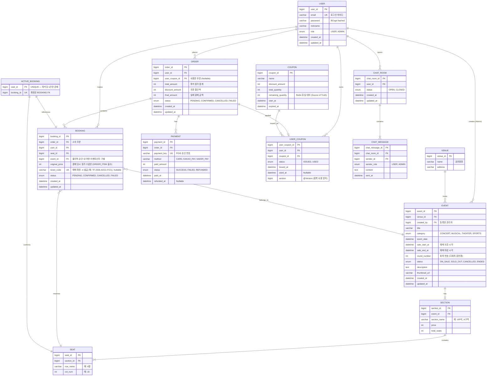

# 🗄️ ERD (Entity Relationship Diagram)

> **문서 버전:** v7.0
> **최종 수정일:** 2026-04-10
> **변경 사유:**
> - BOOKING.ticket_code 추가 (TICKET 테이블 별도 분리 대신 BOOKING이 티켓 역할 겸임, C-02 B안)
>   - USER_COUPON UNIQUE(user_id, coupon_id) 제약 명시 보강
>   - ORDER.user_coupon_id FK 역할 명확화 (쿠폰 취소 복원 경로)

---

## 1. ERD 다이어그램



---

## 2. 테이블 설계 주요 결정 사항

### 2-1. ORDER_ITEM 삭제 → BOOKING 흡수 + ACTIVE_BOOKING 신규

v5에서 ORDER_ITEM을 삭제하고, 그 역할을 BOOKING이 흡수했다.

| 테이블 | 역할 | 변경 사항 |
|--------|------|-----------|
| `ORDER` | 결제 단위 묶음 | 변경 없음 |
| `BOOKING` | 좌석 단위 점유 + 원가 스냅샷 + 티켓 역할 | `order_id FK`, `original_price`, `event_id FK`, `status`, `ticket_code` 추가 |
| `ACTIVE_BOOKING` | 확정된 예약만 보관 | **신규** — `UNIQUE(seat_id)`로 중복 확정 물리적 차단 |

**ORDER_ITEM 삭제 근거:**
ORDER_ITEM은 ORDER ↔ BOOKING 연결 + 원가 스냅샷 역할을 했다.
BOOKING이 `order_id`와 `original_price`를 직접 보유하면 동일 역할을 한 테이블로 커버할 수 있어 JOIN 뎁스가 줄어든다.
3주 MVP 범위에서는 ORDER_ITEM의 추가적인 확장성보다 단순한 구조가 개발 속도에 유리하다.

**TICKET 테이블 미분리 근거 (C-02 B안 선택):**

API 웹훅 응답에서 `ticketId`, `ticketCode`를 반환해야 하므로 별도 TICKET 테이블이 필요하다는 피드백이 있었으나,
MVP 범위에서는 BOOKING 자체가 티켓 역할을 겸하는 B안을 선택한다.

| 구분 | A안 (TICKET 테이블 분리) | B안 (BOOKING이 티켓 역할) |
|------|--------------------------|---------------------------|
| 테이블 수 | +1 (TICKET 추가) | 변경 없음 |
| JOIN 복잡도 | 증가 (BOOKING → TICKET) | 유지 |
| API 응답 | `ticketId` = TICKET.ticket_id | `ticketId` = BOOKING.booking_id |
| 확장성 | 재발급·여러 장 발급 유리 | MVP 범위에서 충분 |
| **선택 이유** | — | 3주 MVP에서 단순 구조가 개발 속도 유리 |

웹훅 응답의 `tickets[]` 배열은 `bookingId`와 `ticketCode`(BOOKING.ticket_code)로 구성한다.
`ticket_code`는 예매 확정 시 서버에서 생성 (`"TF-" + 연도 + 좌석정보 + UUID 앞 4자리` 형식)하여 BOOKING에 저장한다.

### 2-2. ACTIVE_BOOKING — MySQL 레벨 중복 확정 방어선

MySQL은 `WHERE status='CONFIRMED'` 조건부 유니크 인덱스(Partial Index)를 지원하지 않는다.
`ACTIVE_BOOKING` 테이블을 분리하고 `seat_id`를 PRIMARY KEY로 설정함으로써, 동일 좌석에 두 번째 CONFIRMED 행이 삽입되는 것을 DB 레벨에서 원천 차단한다.

```sql
CREATE TABLE active_booking (
    seat_id    BIGINT PRIMARY KEY,           -- 좌석당 1건만 허용
    booking_id BIGINT UNIQUE NOT NULL,       -- 어떤 예약이 확정됐는지
    FOREIGN KEY (seat_id)    REFERENCES seat(seat_id),
    FOREIGN KEY (booking_id) REFERENCES booking(booking_id)
);
```

| 시점 | 처리 |
|------|------|
| 예매 확정 (웹훅 수신) | `ACTIVE_BOOKING INSERT` — seat_id 중복이면 즉시 에러 → 롤백 |
| 예매 취소 | `ACTIVE_BOOKING DELETE` → `BOOKING.status = CANCELLED` |
| 이력 | BOOKING 테이블에 모든 상태 변경 이력이 남음 |

Redis 분산락이 1차 방어선이라면, ACTIVE_BOOKING의 PK 제약은 2차 방어선이다.
락 구현 버그나 Redis 장애 상황에서도 중복 확정을 막는다.

### 2-3. SEAT.status 삭제 — 상태 관리 책임 분리

| 이전 (v4) | 이후 (v5) |
|-----------|-----------|
| `SEAT.status`: AVAILABLE / CONFIRMED | SEAT 테이블에 status 없음 |
| ON_HOLD → Redis TTL | 동일 (변경 없음) |
| CONFIRMED → `SEAT.status = CONFIRMED` | CONFIRMED → `ACTIVE_BOOKING` 행 존재 여부 |

좌석 목록 조회 시 상태 판단 로직:

```
1. ACTIVE_BOOKING에 해당 seat_id가 존재 → CONFIRMED
2. Redis hold:{eventId}:{seatId} 키가 존재 → ON_HOLD
3. 그 외 → AVAILABLE
```

### 2-4. EVENT 테이블 변경

| 컬럼 | 내용 |
|------|------|
| `round_number` 추가 | 다회차 공연 표현. "공연 1건 = 회차 1건" 원칙 유지. 동일 공연의 n번째 회차를 n개의 EVENT 행으로 표현 |
| `status` 추가 | `ON_SALE`, `SOLD_OUT`, `CANCELLED`, `ENDED` — 이벤트 판매 상태를 명시적으로 관리 |

**status 전환 기준**

| 상태 | 전환 주체 | 전환 조건 |
|------|----------|----------|
| `ON_SALE` | 이벤트 등록 시 기본값 | — |
| `SOLD_OUT` | 시스템 (예매 확정 시) | 잔여 좌석 = 0 |
| `CANCELLED` | 관리자 수동 | — |
| `ENDED` | 스케줄러 자동 | `eventDate < now()` AND `status IN (ON_SALE, SOLD_OUT)` |

다회차 표현 예시:

```sql
INSERT INTO event (title, venue_id, event_date, round_number, status) VALUES
  ('레미제라블', 1, '2024-03-01', 1, 'ON_SALE'),
  ('레미제라블', 1, '2024-03-02', 2, 'ON_SALE'),
  ('레미제라블', 1, '2024-03-31', 31, 'ON_SALE');
```

### 2-5. BOOKING.event_id — 물리적 공간 구별

같은 공연장(Venue)에서 날짜별로 다른 EVENT가 열릴 수 있다.
SEAT는 물리적 좌석이라 공연장에 종속되므로, BOOKING만 보면 이 예약이 어떤 회차(EVENT)에 대한 것인지 알 수 없다.
`BOOKING.event_id`는 이 문제를 해결하기 위한 역정규화다. Immutable 값이므로 부작용 없다.

### 2-5-1. BOOKING.user_id — 조회 성능을 위한 역정규화 (M-04)

`ORDER` 테이블에 이미 `user_id FK`가 있으므로, `BOOKING.user_id`는 `ORDER → user_id` 경로로 조회 가능한 중복 컬럼이다.
그러나 아래 이유로 역정규화를 허용한다.

| 항목 | 내용 |
|------|------|
| **조회 패턴** | `GET /api/users/me/bookings` — 내 예매 내역 조회 시 `ORDER JOIN` 없이 `BOOKING.user_id`로 직접 필터링 가능 |
| **인덱스 활용** | `BOOKING(user_id)` 단일 인덱스로 `WHERE user_id = ?` 쿼리를 ORDER JOIN 없이 처리 |
| **Immutable** | BOOKING 생성 시 user_id가 고정되므로 갱신 이상(Update Anomaly) 없음 |
| **결론** | 읽기 성능 이득 > JOIN 제거로 인한 경미한 중복 허용 |

### 2-6. VENUE.capacity 삭제

잔여 좌석 수는 `SEAT` 테이블 기반으로 동적 계산한다. `capacity` 고정값은 실제 좌석 수와 불일치할 가능성이 있어 삭제한다.

### 2-7. COUPON.remaining_quantity — Redis와 MySQL 이중 관리 (m-06)

선착순 쿠폰 발급 시 Redis에서 원자적으로 수량을 차감하지만, Redis 데이터 유실(재시작 등)에 대비해 MySQL에도 `remaining_quantity`를 Source of Truth로 보관한다.

| 저장소 | 역할 | 이유 |
|--------|------|------|
| Redis | 실시간 수량 차감 (DECR + Lua Script) | 원자적 연산, 동시성 처리 |
| MySQL `remaining_quantity` | 최종 수량 정합성 보장 | Redis 유실 시 복구 기준 |

**MySQL remaining_quantity 차감 시점 및 동기화 방식:**

| 시점 | 처리 |
|------|------|
| Redis DECR 성공 직후 | `UPDATE coupon SET remaining_quantity = remaining_quantity - 1 WHERE coupon_id = ?` 즉시 실행 |
| DB fallback 경로 (Redis 연결 실패) | `SELECT ... FOR UPDATE` 후 `remaining_quantity` 직접 차감 |
| Redis 복구 후 | MySQL `remaining_quantity` 값을 기준으로 Redis 카운터 재초기화 (`SET coupon:stock:{couponId} {remaining_quantity}`) |

> **주의:** Redis DECR 성공 후 MySQL UPDATE가 실패하면 Redis와 MySQL 간 수량 불일치가 발생한다.
> 이 경우 MySQL `remaining_quantity`가 실제보다 1 많은 상태가 되므로,
> 장애 복구 시 Redis를 MySQL 기준으로 재초기화하여 정합성을 맞춘다.
> (Redis 카운터가 MySQL보다 1 적은 것은 발급 수 과소 → 허용 가능한 방향의 오차)

### 2-8. USER_COUPON.version — 낙관적 락으로 중복 사용 방지

| 시점 | 제어 방식 | 이유 |
|------|-----------|------|
| 쿠폰 발급 | Redis Atomic DECR + Lua Script (분산락 미사용 — L-01 대응) | DECR 자체가 원자적이므로 추가 락 불필요 |
| 쿠폰 사용 (예매 내) | `lock:user-coupon-use:{userCouponId}` 분산락 + `@Version` 낙관적 락 | 예매 플로우 내 쿠폰 사용은 중복 사용 방지 필요 |
| 쿠폰 복원 (취소 시) | `SELECT ... FOR UPDATE` 비관적 락 (C-03 대응) | 복원 중 동일 쿠폰 재사용 시도와의 충돌 방지 |

---

## 3. 인덱스 설계

| 테이블 | 인덱스 대상 컬럼 | 타입 | 이유 |
|--------|----------------|------|------|
| EVENT | `(category, event_date)` | 복합 | 장르별 + 날짜 범위 검색 빈번 |
| EVENT | `title` | 단일 | LIKE 검색 대상 |
| BOOKING | `(seat_id, status)` | 복합 | 좌석별 예약 상태 조회 |
| BOOKING | `user_id` | 단일 | 내 예매 내역 조회 |
| BOOKING | `order_id` | 단일 | 주문별 예약 목록 조회 |
| ORDER | `user_id` | 단일 | 내 주문 내역 조회 |
| USER_COUPON | `(coupon_id, user_id)` | 복합 UK | 중복 발급 방지 (UNIQUE 제약 겸용) |
| CHAT_MESSAGE | `(chat_room_id, chat_message_id DESC)` | 복합 | 커서 기반 최신 메시지 조회 |
| CHAT_ROOM | `(user_id, status)` | 복합 | 사용자별/상태별 문의 조회 |

---

## 4. 도메인 경계 정리

```
[User Context]
  └─ USER

[Catalog Context]
  └─ VENUE, EVENT, SECTION, SEAT

[Booking/Order Context]
  └─ ORDER, BOOKING, ACTIVE_BOOKING

[Payment Context]
  └─ PAYMENT

[Promotion Context]
  └─ COUPON, USER_COUPON

[CS Context]
  └─ CHAT_ROOM, CHAT_MESSAGE
```

각 컨텍스트는 다른 컨텍스트의 엔티티를 직접 참조하지 않고 ID(FK)로만 참조한다.