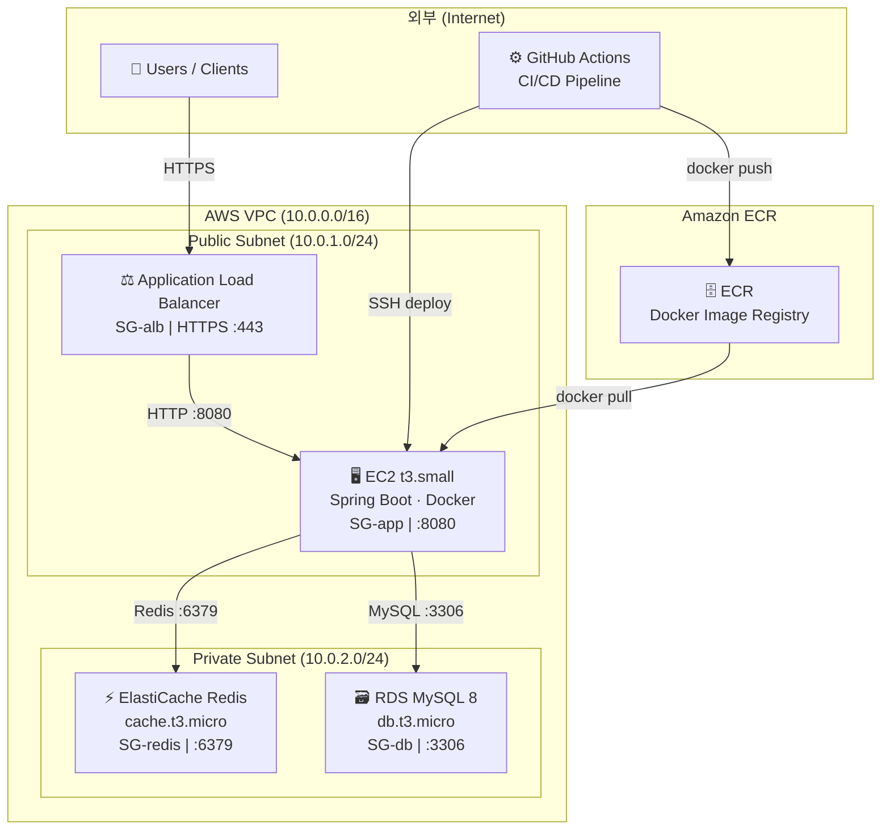

# 🏗️ 인프라 아키텍처 다이어그램

> **문서 버전:** v1.0
> **최종 수정일:** 2026-04-10
> **연결 문서:** 1. 프로젝트 개요서, 4. 기능명세서, 0. 피드백 반영 사항

---

## 1. 아키텍처 다이어그램



---

> **⚠️ 환경별 인스턴스 구분:**
> 다이어그램은 **실서비스 최소 구성(t3.small)** 기준으로 작성됐습니다.
> AWS 프리티어 무료 개발·테스트 환경에서는 **t2.micro(EC2), db.t2.micro(RDS), cache.t2.micro(ElastiCache)** 를 사용합니다.
> EC2가 Public Subnet에 배치된 이유: ALB에서 인바운드를 받아야 하므로 인터넷 게이트웨이 접근이 필요합니다. DB/Redis는 Private Subnet에 격리하여 외부 직접 접근을 차단합니다.

---

## 2. 컴포넌트별 역할

| 컴포넌트 | 인스턴스 타입 | 역할 한 줄 설명 |
|----------|--------------|----------------|
| **EC2** | t3.small | Spring Boot 앱 서버 — 티켓 예매 API, 분산락, 쿠폰, CS 채팅 등 모든 비즈니스 로직 실행 |
| **RDS MySQL 8** | db.t3.micro | ORDER, BOOKING, ACTIVE_BOOKING, USER_COUPON 등 모든 영속 데이터의 Source of Truth |
| **ElastiCache Redis** | cache.t3.micro | 좌석 Hold TTL 관리, 쿠폰 선착순 수량 원자적 DECR, 분산락(Lettuce SETNX), 인기 검색어 ZSet |
| **ECR** | — | GitHub Actions가 빌드한 Docker 이미지를 저장하고 EC2가 pull하는 레지스트리 |
| **ALB** | — | 외부 HTTPS 트래픽을 EC2로 라우팅, SSL 종료 (ACM 인증서 연결) |
| **GitHub Actions** | — | main 브랜치 push 시 테스트 → 빌드 → ECR push → EC2 배포 자동화 |

---

## 3. VPC / 보안 그룹 구성

### 3-1. 서브넷 구성

| 서브넷 | CIDR | 배치 컴포넌트 | 인터넷 게이트웨이 |
|--------|------|--------------|-----------------|
| Public Subnet | 10.0.1.0/24 | ALB, EC2 | ✅ 연결됨 |
| Private Subnet | 10.0.2.0/24 | RDS, ElastiCache | ❌ 차단 |

> **설계 원칙:** RDS와 ElastiCache는 Private Subnet에 격리하여 외부에서 직접 접근 불가.
> EC2만 두 서브넷에 걸쳐 통신할 수 있는 중간 계층 역할.

### 3-2. 보안 그룹 규칙

| 보안 그룹 | 인바운드 허용 | 아웃바운드 | 역할 |
|-----------|-------------|-----------|------|
| **SG-alb** | `0.0.0.0/0 → 443 (HTTPS)` | EC2:8080 | 외부 사용자 HTTPS 트래픽 수신 |
| **SG-app** | `SG-alb → 8080` / `GitHub Actions IP → 22 (SSH)` | RDS:3306, Redis:6379, 0.0.0.0/0:443 | ALB에서만 앱 접근, SSH는 배포 전용 |
| **SG-db** | `SG-app → 3306` | — | EC2만 DB 접근, 외부 완전 차단 |
| **SG-redis** | `SG-app → 6379` | — | EC2만 Redis 접근, 외부 완전 차단 |

### 3-3. 보안 강화 로드맵

```
[현재 MVP]
  EC2 SSH → GitHub Actions IP 직접 허용 (22번 포트)

[추후 강화]
  Bastion Host 도입 → EC2 SSH 포트 완전 차단
  GitHub Actions → Bastion → EC2 경유 배포
  또는 AWS SSM Session Manager 사용 (SSH 없이 접근)
```

---

## 4. 예상 월 비용

### 4-1. AWS 프리티어 (12개월 이내)

| 항목 | 스펙 | 비용 | 비고 |
|------|------|------|------|
| EC2 | t2.micro (750h/월) | **무료** | 프리티어 한도 내 |
| RDS | db.t2.micro (750h/월) | **무료** | 단일 AZ, 20GB SSD |
| ElastiCache | cache.t2.micro (750h/월) | **무료** | 단일 노드 |
| ECR | 500MB/월 | **무료** | 이미지 용량 관리 필요 |
| ALB | LCU 기반 | **~$18** | 프리티어 제외 항목 |
| 데이터 전송 | 15GB/월 | **무료** | 초과 시 $0.09/GB |
| **합계** | | **~$18/월** | ALB만 유료 |

> 💡 **프리티어 절약 팁:** ALB 대신 EC2 Public IP에 직접 붙이면 거의 $0. 단, HTTPS 미적용 상태이므로 개발·테스트 환경 전용으로만 권장.

### 4-2. 실서비스 최소 구성

| 항목 | 스펙 | 비용 | 비고 |
|------|------|------|------|
| EC2 | t3.small | **~$15/월** | 2 vCPU, 2GB RAM |
| RDS | db.t3.small (Multi-AZ) | **~$56/월** | Multi-AZ 적용 시 2배 |
| RDS | db.t3.micro (Single-AZ) | **~$28/월** | 비용 절감 시 Single-AZ |
| ElastiCache | cache.t3.small | **~$25/월** | 단일 노드 |
| ECR | ~2GB | **~$1/월** | |
| ALB | — | **~$18/월** | |
| 데이터 전송 | ~10GB | **~$5/월** | |
| **합계 (Single-AZ)** | | **~$92/월** | |
| **합계 (Multi-AZ)** | | **~$120/월** | RDS 이중화 포함 |

---

## 5. 배포 파이프라인 흐름

### 5-1. 전체 흐름

```
main 브랜치 push
        │
        ▼
① GitHub Actions Workflow 트리거
        │
        ├─ [Test] ./gradlew test
        │    └─ 단위 테스트 + 통합 테스트 실행
        │    └─ 실패 시 → 파이프라인 중단, Slack/Email 알림
        │
        ├─ [Build] docker build -t ticket-flow .
        │    └─ Dockerfile 기반 JAR 빌드 + 이미지 생성
        │
        ├─ [Push] ECR 로그인 + 이미지 push
        │    └─ aws ecr get-login-password | docker login
        │    └─ docker tag ticket-flow {ECR_URI}:$GITHUB_SHA
        │    └─ docker push {ECR_URI}:$GITHUB_SHA
        │
        └─ [Deploy] EC2 SSH 접속 + 컨테이너 교체
             └─ docker pull {ECR_URI}:$GITHUB_SHA
             └─ docker stop ticket-flow (기존 컨테이너 종료)
             └─ docker run -d --name ticket-flow \
                  -e DB_URL=${{ secrets.DB_URL }} \
                  -e REDIS_HOST=${{ secrets.REDIS_HOST }} \
                  -p 8080:8080 \
                  {ECR_URI}:$GITHUB_SHA
             └─ (ALB Health Check 경로: GET /actuator/health → 200 OK 확인 후 트래픽 전환)
```

### 5-2. GitHub Actions Workflow 예시

```yaml
name: TicketJavara CI/CD

on:
  push:
    branches: [ main ]

env:
  AWS_REGION: ap-northeast-2
  ECR_REPOSITORY: ticketjavara
  EC2_HOST: ${{ secrets.EC2_HOST }}

jobs:
  test:
    runs-on: ubuntu-latest
    steps:
      - uses: actions/checkout@v4          # v3 → v4 (Node.js 24 대응)
      - uses: actions/setup-java@v4        # v3 → v4 (Node.js 24 대응)
        with:
          java-version: '17'
          distribution: 'temurin'
      - name: Run Tests
        run: ./gradlew test

  build-and-deploy:
    needs: test
    runs-on: ubuntu-latest
    steps:
      - uses: actions/checkout@v4          # v3 → v4 (Node.js 24 대응)

      - name: Configure AWS credentials
        uses: aws-actions/configure-aws-credentials@v4  # v2 → v4 (Node.js 24 대응)
        with:
          aws-access-key-id: ${{ secrets.AWS_ACCESS_KEY_ID }}
          aws-secret-access-key: ${{ secrets.AWS_SECRET_ACCESS_KEY }}
          aws-region: ${{ env.AWS_REGION }}

      - name: Login to Amazon ECR
        id: login-ecr
        uses: aws-actions/amazon-ecr-login@v2  # v1 → v2 (Node.js 24 대응)

      - name: Build, tag, and push image to ECR
        env:
          ECR_REGISTRY: ${{ steps.login-ecr.outputs.registry }}
          IMAGE_TAG: ${{ github.sha }}
        run: |
          docker build -t $ECR_REGISTRY/$ECR_REPOSITORY:$IMAGE_TAG .
          docker push $ECR_REGISTRY/$ECR_REPOSITORY:$IMAGE_TAG

      - name: Deploy to EC2
        uses: appleboy/ssh-action@v1       # v0.1.10 → v1 (Node.js 24 대응)
        with:
          host: ${{ secrets.EC2_HOST }}
          username: ec2-user
          key: ${{ secrets.EC2_SSH_KEY }}
          envs: ECR_REGISTRY,ECR_REPOSITORY,IMAGE_TAG
          script: |
            aws ecr get-login-password --region ap-northeast-2 \
              | docker login --username AWS --password-stdin $ECR_REGISTRY
            docker pull $ECR_REGISTRY/$ECR_REPOSITORY:$IMAGE_TAG
            docker stop ticket-flow || true
            docker rm ticket-flow || true
            docker run -d --name ticket-flow \
              -p 8080:8080 \
              -e DB_URL=$DB_URL \
              -e REDIS_HOST=$REDIS_HOST \
              -e JWT_SECRET=$JWT_SECRET \
              $ECR_REGISTRY/$ECR_REPOSITORY:$IMAGE_TAG
            # ALB Health Check 경로: GET /actuator/health
```

### 5-3. GitHub Secrets 등록 목록

| Secret 이름 | 값 | 용도 |
|-------------|---|------|
| `AWS_ACCESS_KEY_ID` | IAM 액세스 키 | ECR 로그인, 이미지 push |
| `AWS_SECRET_ACCESS_KEY` | IAM 시크릿 키 | ECR 로그인, 이미지 push |
| `EC2_HOST` | EC2 퍼블릭 IP | SSH 접속 대상 |
| `EC2_SSH_KEY` | EC2 PEM 키 내용 | SSH 인증 |
| `DB_URL` | `jdbc:mysql://{RDS_ENDPOINT}:3306/ticketjavara` | 앱 DB 연결 |
| `REDIS_HOST` | ElastiCache 엔드포인트 | 앱 Redis 연결 |
| `JWT_SECRET` | JWT 서명 키 | 인증 |

> **보안 원칙:** EC2 IAM Role에는 `ecr:GetAuthorizationToken`, `ecr:BatchGetImage` 권한만 부여 (최소 권한 원칙).
> 직접 IAM 키를 EC2에 설치하지 말 것.

### 5-4. 롤백 전략

```
# 이전 이미지 SHA로 즉시 롤백
docker pull {ECR_URI}:{이전_GITHUB_SHA}
docker stop ticket-flow
docker run -d --name ticket-flow {ECR_URI}:{이전_GITHUB_SHA}
```

ECR에 이미지 태그가 커밋 SHA 기준으로 보관되어 있으므로,
이전 SHA를 지정하면 코드 변경 없이 즉시 롤백 가능.

---

## 6. 로컬 개발 환경 (Docker Compose)

```yaml
# docker-compose.yml
version: '3.8'

services:
  mysql:
    image: mysql:8.0
    container_name: ticketjavara-mysql
    environment:
      MYSQL_ROOT_PASSWORD: root
      MYSQL_DATABASE: ticketjavara
    ports:
      - "3306:3306"
    volumes:
      - mysql_data:/var/lib/mysql

  redis:
    image: redis:7.0
    container_name: ticketjavara-redis
    ports:
      - "6379:6379"

  app:
    build: .
    container_name: ticketjavara-app
    depends_on:
      - mysql
      - redis
    ports:
      - "8080:8080"
    environment:
      DB_URL: jdbc:mysql://mysql:3306/ticketjavara
      REDIS_HOST: redis
      JWT_SECRET: local-dev-secret

volumes:
  mysql_data:
```

> **Day 1~2 Critical Milestone:** 팀원 E가 Docker Compose 환경을 완성하고 전 팀원이 검증 완료해야 이후 개발이 막힘 없이 진행됨.

---

## 7. 주요 변경 이력

| 버전 | 변경 내용 | 일자 |
|------|-----------|------|
| v1.0 | 최초 작성 — EC2, RDS, ElastiCache, ECR, GitHub Actions 구성 | 2026-04-10 |
| v1.1 | 컨테이너명·DB명 ticketflow → ticketjavara 통일 | 2026-04-13 |
| v1.2 | GitHub Actions 액션 버전 일괄 업그레이드 (Node.js 24 대응, 2026-06-02 강제 전환 전 선제 조치) — `checkout@v3→v4`, `setup-java@v3→v4`, `configure-aws-credentials@v2→v4`, `amazon-ecr-login@v1→v2`, `ssh-action@v0.1.10→v1` | 2026-04-13 |
